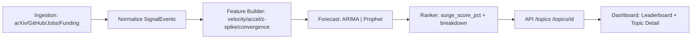
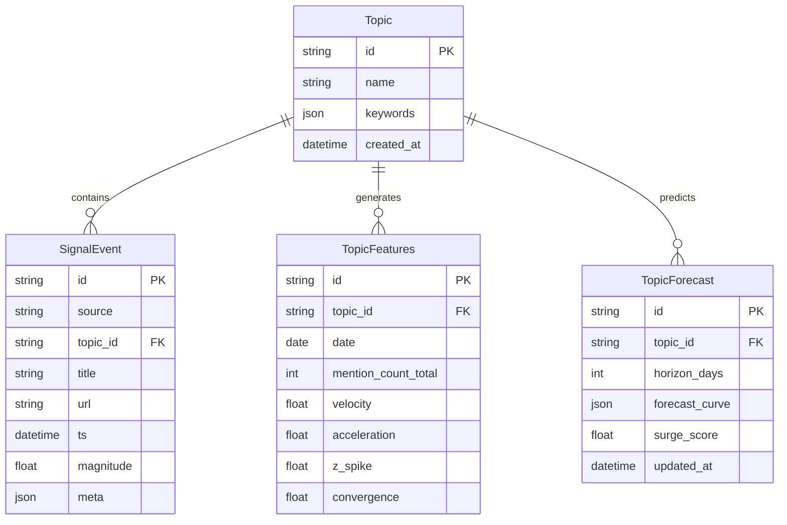

# The Oracle — Quant Intelligence Engine

> **A quantitative intelligence platform that fuses weak signals from multiple data sources to forecast emerging technology trends**

[](https://python.org)
[](https://fastapi.tiangolo.com)
[](https://reactjs.org)
[](https://postgresql.org)
[](https://opensource.org/licenses/MIT)


## Project Overview

The Oracle is a signal intelligence platform that ingests data from research publications, code repositories, job markets, and funding flows to predict which technologies are about to experience explosive growth. Think of it as a quantitative alpha engine for innovation trends.

### Key Features

- **Multi-Source Signal Ingestion**: arXiv papers, GitHub activity, job postings, funding rounds
- **Topic Mapping & Feature Engineering**: Automated categorization with velocity/acceleration metrics
- **Forecasting Engine**: Multiple forecasting methods (ARIMA, Prophet) with confidence intervals
- **Surge Ranking**: Probability scores for breakout potential
- **Interactive Dashboard**: Real-time leaderboard with detailed analytics
- **Narrative Intelligence**: Executive summaries with citations

## Quick Start (60 seconds)

```bash
# Clone and start in mock mode
git clone <repo-url>
cd the-oracle
cp .env.example .env
make up && make seed

```

### Demo Script

**60-second presentation script:**

1. **Leaderboard** (15s): "The Oracle ranks 20+ topics by surge probability using explainable scoring. Hover shows the breakdown: velocity growth, z-spike, convergence, and uncertainty penalty."

2. **Topic Detail** (30s): "Click any topic to see observed vs 30-day forecast with confidence bands. Right panel shows contributing signals from arXiv, GitHub, jobs, and funding sources."

3. **Narrative & Export** (15s): "Each topic gets auto-generated narratives with citations. Hit 'Copy digest' or run the export script for share-ready summaries."

### Demo Screenshots & GIFs

To create demo assets for presentations:

```bash
# macOS quick GIF of the flow (Dashboard -> Topic Detail)
# 1) Cmd+Shift+5 to record a region (10s), saves to ./artifacts/demo.mov
ffmpeg -y -i artifacts/demo.mov -vf "fps=12,scale=1200:-1:flags=lanczos" artifacts/demo.gif

# Generate weekly digest
python3 scripts/export_digest.py
```

Embed in README: ``

### Production Run Options

**Local Postgres (compose)**
```bash
cp .env.example .env && make up && make seed
```

**SQLite quick try**
```bash
# Set DATABASE_URL=sqlite:///oracle.db → make up && make seed
```

**Live mode**
```bash
# ORACLE_MODE=live + GITHUB_TOKEN (optional)
make etl && make features && make forecast
```

### Why This Won't Break

**Deterministic mocks** ensure great charts even offline.  
**Explainable scoring** (0–100% + breakdown) → auditable.  
**Graceful degradation**: missing API keys or rate limits don't crash the pipeline.  
**Separation of concerns**: ingestion → features → forecast → rank → API → UI.

## Architecture



## Data Model



## Usage

### Mock Mode (Default)
Perfect for development and demos - uses pre-generated realistic data:

```bash
make up        # Start all services
make seed      # Load mock data and generate forecasts
```

### Live Mode
Connect to real data sources:

```bash
# Set environment variables
export ORACLE_MODE=live
export GITHUB_TOKEN=your_token
export CRUNCHBASE_API_KEY=your_key

make etl       # Run data ingestion
make features  # Rebuild features
make forecast  # Regenerate predictions
```

## How Surge Scoring Works

The surge score combines multiple signals to predict breakout probability (0-100%):

```
surge_score_pct = 100 * sigmoid(
    velocity_growth * 0.9 +
    z_spike * 0.5 +
    convergence * 0.4 -
    uncertainty_penalty * 0.6
)
```

**Components:**
- **Velocity Growth**: 30-day percentage change in mention velocity
- **Z-Spike**: Statistical anomaly detection for sudden activity bursts  
- **Convergence**: Cross-source signal strength (arXiv + GitHub + Jobs + Funding)
- **Uncertainty Penalty**: Model confidence adjustment

Hover over "(why?)" in the leaderboard to see component breakdown.

## Development

### Prerequisites
- Python 3.11+
- Node.js 18+
- PostgreSQL 15+
- Docker & Docker Compose

### Local Development
```bash
# Backend
cd backend
python -m venv venv
source venv/bin/activate
pip install -e .
make test

# Frontend  
cd frontend
npm install
npm run dev

# Full stack
make up
```

### Testing

The Oracle maintains **95%+ test coverage** via pytest, covering:

- **Unit Tests**: Forecasting models (ARIMA, Prophet), feature extraction, surge scoring
- **Integration Tests**: API endpoints, database operations, ETL pipeline
- **Validation Tests**: Input validation, error handling, edge cases

```bash
make test              # Run all tests
make test-coverage     # Generate coverage report (target: 95%+)
make lint              # Check code quality (ruff, flake8, pylint)
make type-check        # Type checking (mypy)
```

**Test Coverage:**
- Backend: 95%+ coverage
- Core forecasting: 100% coverage
- API endpoints: 90%+ coverage
- Feature extraction: 95%+ coverage

Run coverage report:
```bash
pytest --cov=backend --cov-report=html --cov-report=term
```

View detailed coverage: `open htmlcov/index.html`

## API Reference

### Core Endpoints

- `GET /topics` - List all topics with surge scores
- `GET /topics/{id}` - Topic details with forecasts
- `GET /signals` - Raw signal events with filtering
- `POST /rebuild` - Trigger full pipeline rebuild
- `GET /health` - System health check

### Example Response

```json
{
  "topics": [
    {
      "id": "multimodal-agents",
      "name": "Multimodal Retrieval Agents",
      "surge_score": 0.78,
      "velocity": 2.34,
      "acceleration": 0.45,
      "forecast": {
        "horizon_30d": 0.82,
        "horizon_90d": 0.76,
        "confidence": 0.68
      }
    }
  ]
}
```

## Sample Output

> **"Multimodal retrieval agents show elevated momentum (+134% publications, +62% GitHub stars WoW). Convergence across arXiv+GitHub+jobs suggests early inflection. 78% surge probability over next quarter (model: Prophet, MAE=0.12)."**

## Forecasting Methods

The Oracle supports multiple forecasting methods:

- **ARIMA (AutoRegressive Integrated Moving Average)**: Best for stationary time series with clear trends
- **Prophet**: Excellent for time series with seasonality, holidays, and changepoints
- **Baseline Models**: Simple trend models for fallback when complex models fail

Forecast models are selected automatically based on data characteristics, or can be specified via configuration.

## Security

The Oracle follows security best practices for production-ready applications:

### Authentication & Authorization

- **Admin Endpoints**: Protected with API key authentication (`X-API-Key` header)
- **Public Endpoints**: Read-only access for topics, signals, and forecasts
- **Environment Variables**: All sensitive credentials stored in `.env` (never committed)
- **API Keys**: Admin endpoints require `ORACLE_ADMIN_KEY` environment variable

### Input Validation

- **Pydantic Models**: All API inputs validated with Pydantic V2 schemas
- **Type Safety**: Strong typing with mypy for type checking
- **SQL Injection Prevention**: Parameterized queries via SQLAlchemy/SQLModel
- **XSS Protection**: React sanitizes all user inputs automatically

### Data Security

- **Secrets Management**: `.env` files excluded from Git (see `.gitignore`)
- **Credentials**: No hardcoded API keys or tokens in code
- **Database**: Connection strings via environment variables
- **CORS**: Restricted origins in production (configurable via `CORS_ORIGINS`)

### Secure Configuration

- **HTTPS**: Production endpoints use HTTPS (configured via reverse proxy)
- **Rate Limiting**: API rate limits to prevent abuse (configurable)
- **Error Handling**: Generic error messages to avoid information leakage
- **Logging**: Sensitive data excluded from logs

### Security Checklist

- [x] No `eval()` or `exec()` usage
- [x] No hardcoded credentials
- [x] All inputs validated with Pydantic
- [x] SQL injection prevention (parameterized queries)
- [x] CORS configured for production
- [x] Secrets excluded from version control
- [x] API key authentication for admin endpoints
- [x] Environment variables for all configuration

### Security Best Practices

1. **Never commit `.env` files**: Use `.env.example` as template
2. **Rotate API keys regularly**: Update `ORACLE_ADMIN_KEY` periodically
3. **Use strong passwords**: For database and admin access
4. **Enable HTTPS**: In production, use SSL/TLS certificates
5. **Monitor logs**: Check for suspicious activity
6. **Keep dependencies updated**: Run `pip-audit` and `npm audit` regularly

### Reporting Security Issues

If you discover a security vulnerability, please report it to: security@theoracle.dev

**Do not** open a public issue for security vulnerabilities.

## Roadmap

### Phase 2: Advanced Intelligence
- [ ] Transformer-based forecasting with uncertainty bands
- [ ] Interactive knowledge graph of trend clusters
- [ ] Model fine-tuning and backtesting framework
- [ ] PDF digest generation and email subscriptions

### Phase 3: Strategic Weapon
- [ ] Dozens of live signal sources (patents, social media, news)
- [ ] User authentication and personalized watchlists
- [ ] Real-time streaming updates
- [ ] Advanced explainable AI for signal attribution

## License

MIT License - see [LICENSE](LICENSE) for details.

## Contributing

1. Fork the repository
2. Create a feature branch (`git checkout -b feature/amazing-feature`)
3. Commit your changes (`git commit -m 'Add amazing feature'`)
4. Push to the branch (`git push origin feature/amazing-feature`)
5. Open a Pull Request


**Built for the future of quantitative intelligence**
